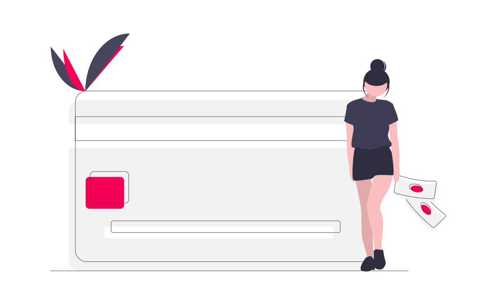

# Bank Churn Modelling

 

* The purpose of this project is to predict whether a customer decides to churn (leave) from the bank or not using [Pyspark](https://spark.apache.org/docs/latest/api/python/index.html). 
* [Dataset Link](https://www.kaggle.com/shrutimechlearn/churn-modelling)

* View the Jupyter Notebook easily by copying [this link](https://github.com/pinkdragon1000/Bank-Churn-Modeling/blob/master/INFO323-Final-Project.ipynb) in the repository above and pasting it into [here](https://nbviewer.jupyter.org/). The purpose of this project is to predict whether a customer decides to churn (leave) from the bank or not. 
